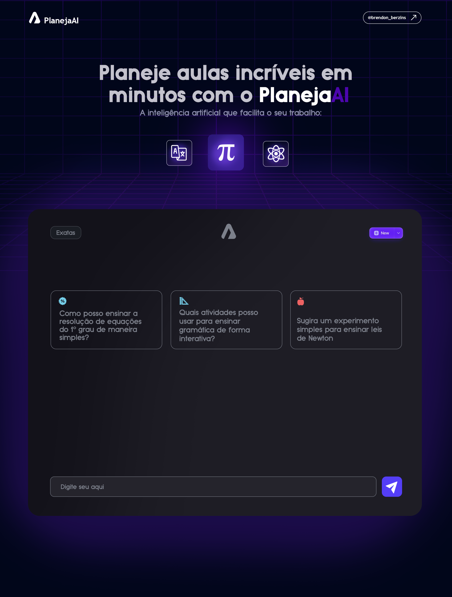

# PlanejaAI
Web app projetado para ajudar professores a planejar suas aulas de forma rápida e eficiente.
Com o PlanejaAI, professores podem automatizar o processo de criação de planos de aula personalizados com base nos objetivos de aprendizagem e conteúdos curriculares.

